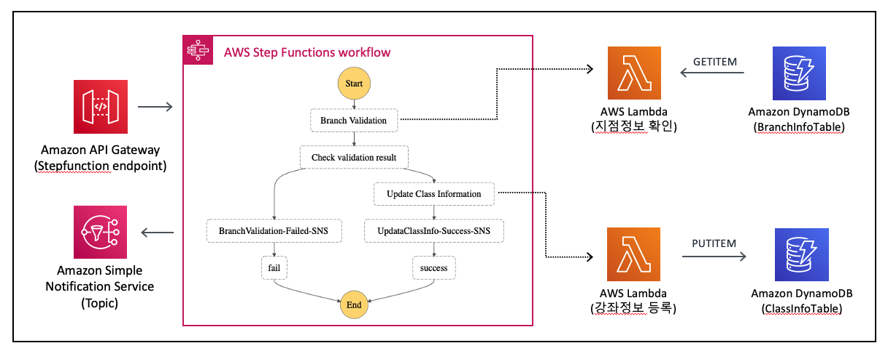

## Stepfunctions-Sample

This project contains source code and supporting files for a serverless application that you can deploy with the SAM CLI. It includes the following files and folders:

- functions - Code for the application's Lambda functions.
- statemachines - Definition for the state machine that orchestrates the stock trading workflow.
- stepfunctions-sample-template.yaml - A template that defines the application's AWS resources.



## Stepfunctions test in Local
local test를 위해서는 docker 혹은 stepfunction downloadable 파일을 다운로드 받은 후, sam, aws cli 를 통해 테스트 가능 
- https://docs.aws.amazon.com/ko_kr/step-functions/latest/dg/sfn-local-lambda.html

## Deploy the sample application via Code build 
- Enterprise CICD pipeline에 업로드 시 buildspec.build.yaml에 따라 build 진행
```bash
$(aws cloudformation list-exports --query "Exports[?Name=='SamBucket'].Value" --output text)

aws cloudformation package --template-file sample.yaml --output-template-file sample-transformed.yaml --s3-bucket $(aws cloudformation list-exports --query "Exports[?Name=='SamBucket'].Value" --output text)

aws cloudformation deploy --template-file sample-transformed.yaml --stack-name sample-project  --capabilities CAPABILITY_IAM
```

## After deployment, test on AWS console
1. Stepfunctions 콘솔 상에서 아래 이벤트로 test execution을 실행하면, 해당 branchcode를 찾을 수 없기 때문에 branchcode validation fail이 발생

```bash
# Event contents
{
  "branch_code": "10",
  "class_name": "xxx",
  "class_info": "xxx, xxx"
}
```

2. DDB Table에 item 생성 

```bash
{
    "branch_code": "10",
    "Available": "true"
}
```

3. Stepfunctions 콘솔 상에서 아래 이벤트로 test execution을 실행하면, stepfunctions이 성공적으로 완료됨 

```bash
# Event contents
{
  "branch_code": "10",
  "class_name": "xxx",
  "class_info": "xxx, xxx"
}
```

4. class table에 입력하였던 class 정보가 입력되었는지 확인


## Stepfunctions with SAM
현재 예제에서는 stepfunction definition 파일이 .asl파일로 정의 되어 있으나, cloudformation teamplate 파일에서 리소스로 작성 가능
- https://docs.amazonaws.cn/en_us/serverless-application-model/latest/developerguide/sam-resource-statemachine.html


## SAM CLI

The Serverless Application Model Command Line Interface (SAM CLI) is an extension of the AWS CLI that adds functionality for building and testing Lambda applications. It uses Docker to run your functions in an Amazon Linux environment that matches Lambda.

To use the SAM CLI, you need the following tools:

* SAM CLI - [Install the SAM CLI](https://docs.aws.amazon.com/serverless-application-model/latest/developerguide/serverless-sam-cli-install.html)
* Node.js - [Install Node.js 12](https://nodejs.org/en/), including the NPM package management tool.
* Docker - [Install Docker community edition](https://hub.docker.com/search/?type=edition&offering=community)


The first command will build the source of your application. The second command will package and deploy your application to AWS, with a series of prompts:

* **Stack Name**: The name of the stack to deploy to CloudFormation. This should be unique to your account and region, and a good starting point would be something matching your project name.
* **AWS Region**: The AWS region you want to deploy your app to.
* **Confirm changes before deploy**: If set to yes, any change sets will be shown to you before execution for manual review. If set to no, the AWS SAM CLI will automatically deploy application changes.
* **Allow SAM CLI IAM role creation**: Many AWS SAM templates, including this example, create AWS IAM roles required for the AWS Lambda function(s) included to access AWS services. By default, these are scoped down to minimum required permissions. To deploy an AWS CloudFormation stack which creates or modified IAM roles, the `CAPABILITY_IAM` value for `capabilities` must be provided. If permission isn't provided through this prompt, to deploy this example you must explicitly pass `--capabilities CAPABILITY_IAM` to the `sam deploy` command.
* **Save arguments to samconfig.toml**: If set to yes, your choices will be saved to a configuration file inside the project, so that in the future you can just re-run `sam deploy` without parameters to deploy changes to your application.

You can find your State Machine ARN in the output values displayed after deployment.

## Resources
Creaete Stepfunctions API on API GATEWAY : https://docs.aws.amazon.com/ko_kr/step-functions/latest/dg/tutorial-api-gateway.html

Stepfunctions API Reference : https://docs.aws.amazon.com/step-functions/latest/apireference/API_StartExecution.html#API_StartExecution_RequestSyntax

Stepfunctions with SAM : 
- 예시 : https://aws.amazon.com/ko/blogs/compute/simplifying-application-orchestration-with-aws-step-functions-and-aws-sam/
- developer guide : https://docs.aws.amazon.com/serverless-application-model/latest/developerguide/sam-resource-statemachine.html

Stepfunctions with CDK : https://www.youtube.com/watch?v=T9iehMn5xHw&list=PLJo-rJlep0EBq0-P-2wq5tzTXjL_jmynX&index=7&t=0s&pbjreload=101